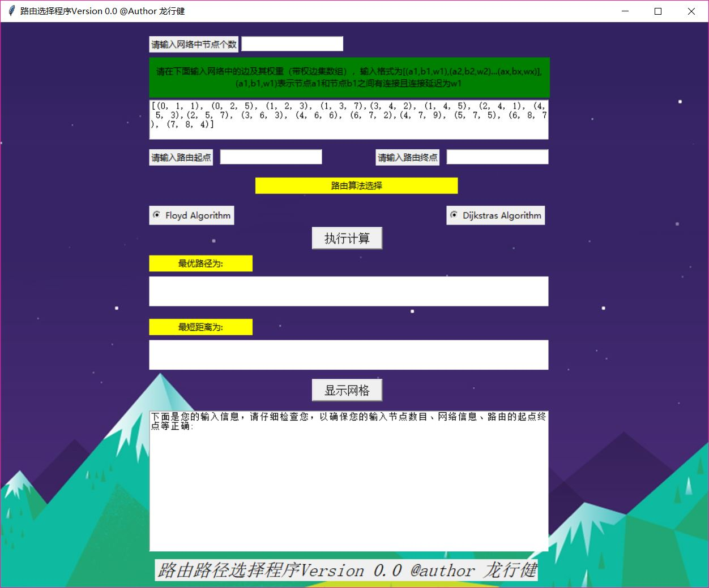
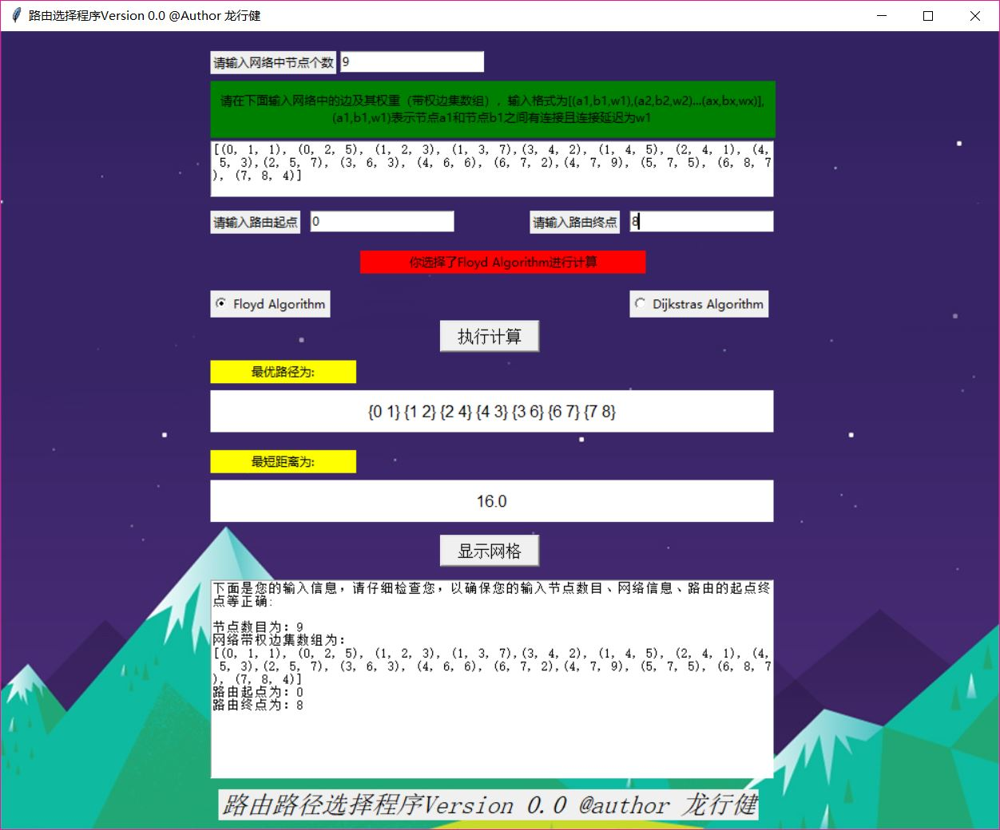
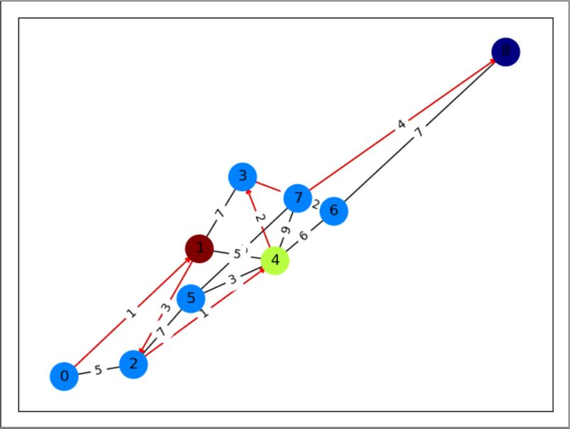

### 运行要求:

```shell
python = 3.5.2, numpy = 1.16.3, **networkx = 2.3**, matplotlib = 2.2.3
```

### 运行说明:

确认环境满足上述运行条件后，进入code文件夹，打开命令行，输入以下命令执行main.py文件以进入GUI界面:

```shell
python main.py
```


运行成功进入GUI界面如下:



**按以下步骤完成一次最短路由设计**

1. 输入网络中的节点数目

2. 输入网络中的边及其权重（带权边集数组），输入格式为[(a1,b1,w1),(a2,b2,w2)...(ax,bx,wx)], (a1,b1,w1)表示节点a1和节点b1之间有连接且连接延迟为w1。

   如下图所示的网络图，其对应的边集数组输入应该为:

   ```python
   [(0, 1, 1), (0, 2, 5), (1, 2, 3), (1, 3, 7),(3, 4, 2), (1, 4, 5), (2, 4, 1), (4, 5, 3),(2, 5, 7), (3, 6, 3), (4, 6, 6), (6, 7, 2),(4, 7, 9), (5, 7, 5), (6, 8, 7), (7, 8, 4)]
   ```

   

3. 输入路由起点和路由终点

4. 选择路由算法

5. 点击执行计算，会在下方给出最短路径和这条最短路径的距离

   

6. 待计算出结果后，点击显示网络生成路由网路图，如下图所示，符合要求的最短路径用红色箭头显示

   