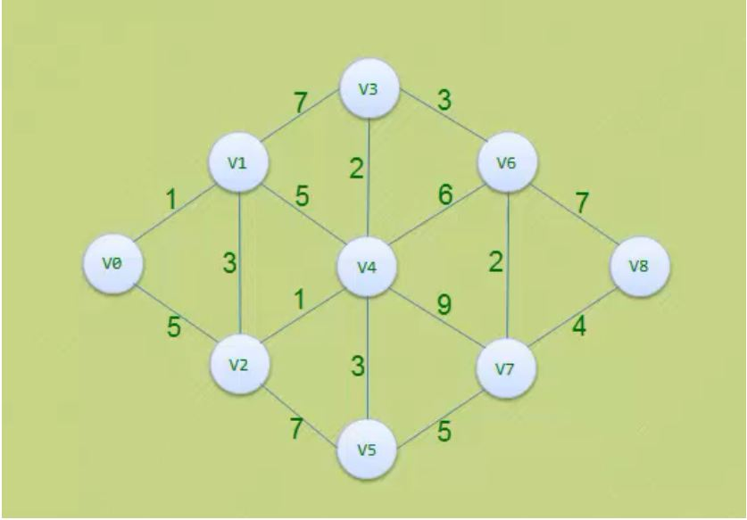

# Path find application with Floyd and Dijkstra algorithm

> Name: Xingjian Long(龙行健) 2017229014
>
> ​			Jincheng LV(吕锦成) 2017229015 

## **Floyd Warshall Algorithm**

The Floyd Warshall Algorithm is for solving the All Pairs Shortest Path problem. The problem is to find shortest distances between every pair of vertices in a given edge weighted directed Graph.

**Example:**

```markdown
Input:
       graph[][] = { {0,   5,  INF, 10},
                    {INF,  0,  3,  INF},
                    {INF, INF, 0,   1},
                    {INF, INF, INF, 0} }
which represents the following graph
             10
       (0)------->(3)
        |         /|\
      5 |          |
        |          | 1
       \|/         |
       (1)------->(2)
            3       
Note that the value of graph[i][j] is 0 if i is equal to j 
And graph[i][j] is INF (infinite) if there is no edge from vertex i to j.

Output:
Shortest distance matrix
      0      5      8      9
    INF      0      3      4
    INF    INF      0      1
    INF    INF    INF      0 
We initialize the solution matrix same as the input graph matrix as a first step. Then we update the solution matrix by considering all vertices as an intermediate vertex. The idea is to one by one pick all vertices and updates all shortest paths which include the picked vertex as an intermediate vertex in the shortest path. When we pick vertex number k as an intermediate vertex, we already have considered vertices {0, 1, 2, .. k-1} as intermediate vertices. For every pair (i, j) of the source and destination vertices respectively, there are two possible cases.
**1)** k is not an intermediate vertex in shortest path from i to j. We keep the value of dist[i][j] as it is.
**2)** k is an intermediate vertex in shortest path from i to j. We update the value of dist[i][j] as dist[i][k] + dist[k][j] if dist[i][j] > dist[i][k] + dist[k][j]
```

The following figure shows the above optimal substructure property in the all-pairs shortest path problem.

[](https://cdncontribute.geeksforgeeks.org/wp-content/uploads/dpFloyd-Warshall-.jpg)

Following is implementations of the Floyd Warshall algorithm.

```python
# Python Program for Floyd Warshall Algorithm 

# Number of vertices in the graph 
V = 4

# Define infinity as the large enough value. This value will be 
# used for vertices not connected to each other 
INF = 99999

# Solves all pair shortest path via Floyd Warshall Algorithm 
def floydWarshall(graph): 

	""" dist[][] will be the output matrix that will finally 
		have the shortest distances between every pair of vertices """
	""" initializing the solution matrix same as input graph matrix 
	OR we can say that the initial values of shortest distances 
	are based on shortest paths considering no 
	intermediate vertices """
	dist = map(lambda i : map(lambda j : j , i) , graph) 
	
	""" Add all vertices one by one to the set of intermediate 
	vertices. 
	---> Before start of an iteration, we have shortest distances 
	between all pairs of vertices such that the shortest 
	distances consider only the vertices in the set 
	{0, 1, 2, .. k-1} as intermediate vertices. 
	----> After the end of a iteration, vertex no. k is 
	added to the set of intermediate vertices and the 
	set becomes {0, 1, 2, .. k} 
	"""
	for k in range(V): 

		# pick all vertices as source one by one 
		for i in range(V): 

			# Pick all vertices as destination for the 
			# above picked source 
			for j in range(V): 

				# If vertex k is on the shortest path from 
				# i to j, then update the value of dist[i][j] 
				dist[i][j] = min(dist[i][j] , 
								dist[i][k]+ dist[k][j] 
								) 
	printSolution(dist) 


# A utility function to print the solution 
def printSolution(dist): 
	print "Following matrix shows the shortest distances\ 
between every pair of vertices" 
	for i in range(V): 
		for j in range(V): 
			if(dist[i][j] == INF): 
				print "%7s" %("INF"), 
			else: 
				print "%7d\t" %(dist[i][j]), 
			if j == V-1: 
				print "" 


# Driver program to test the above program 
# Let us create the following weighted graph 
""" 
			10 
	(0)------->(3) 
		|		 /|\ 
	5 |		 | 
		|		 | 1 
	\|/		 | 
	(1)------->(2) 
			3		 """
graph = [[0,5,INF,10], 
			[INF,0,3,INF], 
			[INF, INF, 0, 1], 
			[INF, INF, INF, 0] 
		] 
# Print the solution 
floydWarshall(graph); 

```

**Output:**

```python
Following matrix shows the shortest distances between every pair of vertices
      0      5      8      9
    INF      0      3      4
    INF    INF      0      1
    INF    INF    INF      0
```

**Time Complexity:** O(V^3)

The above program only prints the shortest distances. We can modify the solution to print the shortest paths also by storing the predecessor information in a separate 2D matrix.
Also, the value of INF can be taken as INT_MAX from limits.h to make sure that we handle maximum possible value. When we take INF as INT_MAX, we need to change the if condition in the above program to avoid arithmetic overflow.

```markdown
#include 

#define INF INT_MAX
..........................
if ( dist[i][k] != INF && 
     dist[k][j] != INF && 
     dist[i][k] + dist[k][j] < dist[i][j]
    )
 dist[i][j] = dist[i][k] + dist[k][j];
...........................
```

## Dijkstra's Algorithm

Given a graph and a source vertex in the graph, find shortest paths from source to all vertices in the given graph.

Dijkstra’s algorithm is very similar to [Prim’s algorithm for minimum spanning tree](https://www.geeksforgeeks.org/prims-minimum-spanning-tree-mst-greedy-algo-5/). Like Prim’s MST, we generate a *SPT (shortest path tree)* with given source as root. We maintain two sets, one set contains vertices included in shortest path tree, other set includes vertices not yet included in shortest path tree. At every step of the algorithm, we find a vertex which is in the other set (set of not yet included) and has a minimum distance from the source.

Below are the detailed steps used in Dijkstra’s algorithm to find the shortest path from a single source vertex to all other vertices in the given graph.
Algorithm
**1)** Create a set *sptSet* (shortest path tree set) that keeps track of vertices included in shortest path tree, i.e., whose minimum distance from source is calculated and finalized. Initially, this set is empty.
**2)** Assign a distance value to all vertices in the input graph. Initialize all distance values as INFINITE. Assign distance value as 0 for the source vertex so that it is picked first.
**3)** While *sptSet* doesn’t include all vertices
….**a)** Pick a vertex u which is not there in *sptSet* and has minimum distance value.
….**b)** Include u to *sptSet*.
….**c)** Update distance value of all adjacent vertices of u. To update the distance values, iterate through all adjacent vertices. For every adjacent vertex v, if sum of distance value of u (from source) and weight of edge u-v, is less than the distance value of v, then update the distance value of v.

Let us understand with the following example:


The set *sptSet* is initially empty and distances assigned to vertices are {0, INF, INF, INF, INF, INF, INF, INF} where INF indicates infinite. Now pick the vertex with minimum distance value. The vertex 0 is picked, include it in *sptSet*. So *sptSet* becomes {0}. After including 0 to *sptSet*, update distance values of its adjacent vertices. Adjacent vertices of 0 are 1 and 7. The distance values of 1 and 7 are updated as 4 and 8. Following subgraph shows vertices and their distance values, only the vertices with finite distance values are shown. The vertices included in SPT are shown in green colour.


Pick the vertex with minimum distance value and not already included in SPT (not in sptSET). The vertex 1 is picked and added to sptSet. So sptSet now becomes {0, 1}. Update the distance values of adjacent vertices of 1. The distance value of vertex 2 becomes 12.


Pick the vertex with minimum distance value and not already included in SPT (not in sptSET). Vertex 7 is picked. So sptSet now becomes {0, 1, 7}. Update the distance values of adjacent vertices of 7. The distance value of vertex 6 and 8 becomes finite (15 and 9 respectively).


We repeat the above steps until *sptSet* doesn’t include all vertices of given graph. Finally, we get the following Shortest Path Tree (SPT).


We use a boolean array sptSet[] to represent the set of vertices included in SPT. If a value sptSet[v] is true, then vertex v is included in SPT, otherwise not. Array dist[] is used to store shortest distance values of all vertices.

```python
# Python program for Dijkstra's single 
# source shortest path algorithm. The program is 
# for adjacency matrix representation of the graph 

# Library for INT_MAX 
import sys 

class Graph(): 

	def __init__(self, vertices): 
		self.V = vertices 
		self.graph = [[0 for column in range(vertices)] 
					for row in range(vertices)] 

	def printSolution(self, dist): 
		print "Vertex tDistance from Source"
		for node in range(self.V): 
			print node,"t",dist[node] 

	# A utility function to find the vertex with 
	# minimum distance value, from the set of vertices 
	# not yet included in shortest path tree 
	def minDistance(self, dist, sptSet): 

		# Initilaize minimum distance for next node 
		min = sys.maxint 

		# Search not nearest vertex not in the 
		# shortest path tree 
		for v in range(self.V): 
			if dist[v] < min and sptSet[v] == False: 
				min = dist[v] 
				min_index = v 

		return min_index 

	# Funtion that implements Dijkstra's single source 
	# shortest path algorithm for a graph represented 
	# using adjacency matrix representation 
	def dijkstra(self, src): 

		dist = [sys.maxint] * self.V 
		dist[src] = 0
		sptSet = [False] * self.V 

		for cout in range(self.V): 

			# Pick the minimum distance vertex from 
			# the set of vertices not yet processed. 
			# u is always equal to src in first iteration 
			u = self.minDistance(dist, sptSet) 

			# Put the minimum distance vertex in the 
			# shotest path tree 
			sptSet[u] = True

			# Update dist value of the adjacent vertices 
			# of the picked vertex only if the current 
			# distance is greater than new distance and 
			# the vertex in not in the shotest path tree 
			for v in range(self.V): 
				if self.graph[u][v] > 0 and sptSet[v] == False and
				dist[v] > dist[u] + self.graph[u][v]: 
						dist[v] = dist[u] + self.graph[u][v] 

		self.printSolution(dist) 

# Driver program 
g = Graph(9) 
g.graph = [[0, 4, 0, 0, 0, 0, 0, 8, 0], 
		[4, 0, 8, 0, 0, 0, 0, 11, 0], 
		[0, 8, 0, 7, 0, 4, 0, 0, 2], 
		[0, 0, 7, 0, 9, 14, 0, 0, 0], 
		[0, 0, 0, 9, 0, 10, 0, 0, 0], 
		[0, 0, 4, 14, 10, 0, 2, 0, 0], 
		[0, 0, 0, 0, 0, 2, 0, 1, 6], 
		[8, 11, 0, 0, 0, 0, 1, 0, 7], 
		[0, 0, 2, 0, 0, 0, 6, 7, 0] 
		]; 

g.dijkstra(0); 

# This code is contributed by Divyanshu Mehta 

```

Output:

```markdown
Vertex   Distance from Source
0                0
1                4
2                12
3                19
4                21
5                11
6                9
7                8
8                14
```

**Notes:**
**1)** The code calculates shortest distance, but doesn’t calculate the path information. We can create a parent array, update the parent array when distance is updated and use it show the shortest path from source to different vertices.

**2)** The code is for undirected graph, same Dijkstra function can be used for directed graphs also.

**3)** The code finds shortest distances from source to all vertices. If we are interested only in shortest distance from the source to a single target, we can break the for the loop when the picked minimum distance vertex is equal to target (Step 3.a of the algorithm).

**4)** Time Complexity of the implementation is O(V^2). If the input graph is represented using adjacency list, it can be reduced to O(E log V) with the help of binary heap. 

**5)** Dijkstra’s algorithm doesn’t work for graphs with negative weight edges. 

## Experiment details

### Requirements for  this application:

```shell
python = 3.5.2, numpy = 1.16.3, **networkx = 2.3**, matplotlib = 2.2.3
```

### How to Run it :

When the requirements are met, go to the code file fold ，open command line tool and type the following command to execute  main.py and we are into the GUI :

```shell
python main.py
```


The GUI  is as following:


**The following steps demonstrate the procedure of find the shortest path in a weighted network**

1. Input the number of vertex in the network

2. Input the lists of arches with weight，it should be like [(a1,b1,w1),(a2,b2,w2)...(ax,bx,wx)], (a1,b1,w1) shows that vertex a1 and vertex b1 are connected and the delay between those two vertex in the network (weights) is w1

   the following network should has the input like:

   ```python
   [(0, 1, 1), (0, 2, 5), (1, 2, 3), (1, 3, 7),(3, 4, 2), (1, 4, 5), (2, 4, 1), (4, 5, 3),(2, 5, 7), (3, 6, 3), (4, 6, 6), (6, 7, 2),(4, 7, 9), (5, 7, 5), (6, 8, 7), (7, 8, 4)]
   ```

   

3. Input the start vertex and end vertex

4. Choose a path finding algorithm

5. Click the "Execute " button to get the shortest path and shortest distances

   

6. After getting the shortest path and distance ，click the "show network" button to show the network，as the following graph. The shortest path are shown in red arrows. 

   